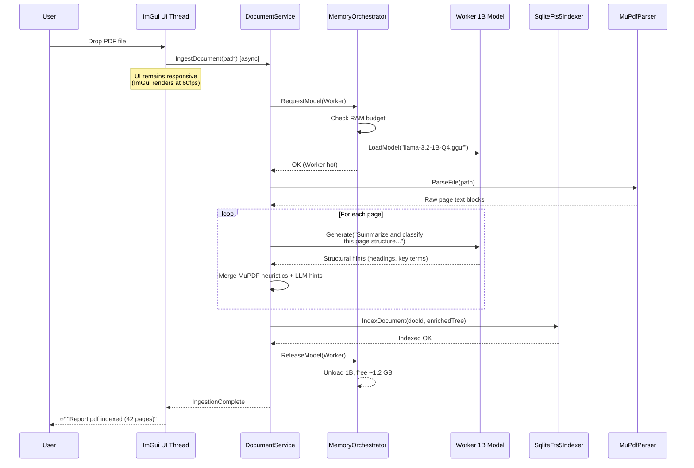

# LocalNotebookLLM — Architectural Refinement v2

> Addendum to [implementation_plan.md](file:///C:/Users/Sid03/.gemini/antigravity/brain/91692e7b-4b66-4d55-9e22-2ce3636a79d4/implementation_plan.md) — integrates 5 critical upgrades.

---

## Upgrade Summary

| # | Change | From | To |
|:--|:-------|:-----|:---|
| 1 | UI Framework | WinUI 3 / Qt | **Dear ImGui + DirectX 11 + DWM Mica** |
| 2 | Model Strategy | Single model | **Dual-Model Pipeline (1B Worker + 4B Reasoner)** |
| 3 | Retrieval | Vectorless BM25-only | **Structural-Hybrid (BM25 → PageIndex → Micro-Embedding fallback)** |
| 4 | DOCX Parsing | Generic library | **Native OpenXML parser (pugixml + minizip)** |
| 5 | LLM Optimization | Default KV cache | **KV Cache Quantization (Q8_0/Q4_0)** |

---

## 1. "Speed-First" UI — Dear ImGui + Mica

### Why the Pivot

| Metric | WinUI 3 | Dear ImGui + DX11 |
|:-------|:--------|:-------------------|
| Cold startup | ~800ms (XAML parse) | **<100ms** |
| Binary size | ~40 MB (WinAppSDK) | **~3 MB** |
| C++ integration | C++/WinRT indirection | **Native C++, zero overhead** |
| Render loop | Framework-managed | **Full control, 60fps locked** |

### Mica Backdrop Implementation

```cpp
// UI/Platform/WindowSetup.h
#pragma once
#include <dwmapi.h>
#pragma comment(lib, "dwmapi.lib")

#ifndef DWMWA_SYSTEMBACKDROP_TYPE
#define DWMWA_SYSTEMBACKDROP_TYPE 38
#endif

namespace LocalNotebookLLM::UI {

    enum DWM_SYSTEMBACKDROP_TYPE {
        DWMSBT_AUTO            = 0,
        DWMSBT_NONE            = 1,
        DWMSBT_MAINWINDOW      = 2,  // Mica
        DWMSBT_TRANSIENTWINDOW = 3,  // Acrylic
        DWMSBT_TABBEDWINDOW    = 4   // Tabbed Mica
    };

    inline bool EnableMicaBackdrop(HWND hwnd) {
        // Enable immersive dark mode
        BOOL darkMode = TRUE;
        DwmSetWindowAttribute(hwnd, 20 /*DWMWA_USE_IMMERSIVE_DARK_MODE*/,
                              &darkMode, sizeof(darkMode));

        // Enable Mica
        auto backdrop = DWMSBT_MAINWINDOW;
        HRESULT hr = DwmSetWindowAttribute(
            hwnd,
            (DWMWINDOWATTRIBUTE)DWMWA_SYSTEMBACKDROP_TYPE,
            &backdrop, sizeof(backdrop));

        return SUCCEEDED(hr);
    }

} // namespace
```

### Apple-Aesthetic ImGui Theme

```cpp
// UI/Theme/AppleTheme.h
#pragma once
#include <imgui.h>

namespace LocalNotebookLLM::UI {

    struct ThemeColors {
        // Dark mode (primary)
        static constexpr ImVec4 Surface         = {0.110f, 0.110f, 0.118f, 0.85f}; // #1C1C1E, 85% alpha for Mica bleed
        static constexpr ImVec4 SurfaceElevated  = {0.173f, 0.173f, 0.180f, 1.0f};  // #2C2C2E
        static constexpr ImVec4 SurfaceOverlay   = {0.227f, 0.227f, 0.235f, 1.0f};  // #3A3A3C
        static constexpr ImVec4 TextPrimary      = {0.960f, 0.960f, 0.968f, 1.0f};  // #F5F5F7
        static constexpr ImVec4 TextSecondary    = {0.596f, 0.596f, 0.616f, 1.0f};  // #98989D
        static constexpr ImVec4 AccentBlue       = {0.161f, 0.592f, 1.000f, 1.0f};  // #2997FF
        static constexpr ImVec4 AccentGreen      = {0.188f, 0.820f, 0.345f, 1.0f};  // #30D158
        static constexpr ImVec4 AccentRed        = {1.000f, 0.271f, 0.227f, 1.0f};  // #FF453A
    };

    inline void ApplyAppleTheme() {
        ImGuiStyle& s = ImGui::GetStyle();

        // Geometry — generous rounding, Apple-like spacing
        s.WindowRounding    = 12.0f;
        s.FrameRounding     = 10.0f;
        s.GrabRounding      = 10.0f;
        s.TabRounding       = 8.0f;
        s.ScrollbarRounding = 10.0f;
        s.ChildRounding     = 10.0f;
        s.PopupRounding     = 10.0f;

        s.WindowPadding     = {20.0f, 20.0f};
        s.FramePadding      = {12.0f, 8.0f};
        s.ItemSpacing       = {10.0f, 8.0f};
        s.ScrollbarSize     = 10.0f;
        s.WindowBorderSize  = 0.0f;
        s.FrameBorderSize   = 0.0f;

        // Anti-aliasing
        s.AntiAliasedLines  = true;
        s.AntiAliasedFill   = true;

        auto* c = s.Colors;
        c[ImGuiCol_WindowBg]          = ThemeColors::Surface;
        c[ImGuiCol_ChildBg]           = {0, 0, 0, 0};  // Transparent for Mica
        c[ImGuiCol_FrameBg]           = ThemeColors::SurfaceElevated;
        c[ImGuiCol_FrameBgHovered]    = ThemeColors::SurfaceOverlay;
        c[ImGuiCol_TitleBg]           = ThemeColors::Surface;
        c[ImGuiCol_TitleBgActive]     = ThemeColors::Surface;
        c[ImGuiCol_Text]              = ThemeColors::TextPrimary;
        c[ImGuiCol_TextDisabled]      = ThemeColors::TextSecondary;
        c[ImGuiCol_Button]            = ThemeColors::AccentBlue;
        c[ImGuiCol_ButtonHovered]     = {0.20f, 0.63f, 1.0f, 1.0f};
        c[ImGuiCol_ButtonActive]      = {0.12f, 0.55f, 0.95f, 1.0f};
        c[ImGuiCol_Header]            = ThemeColors::SurfaceElevated;
        c[ImGuiCol_HeaderHovered]     = ThemeColors::SurfaceOverlay;
        c[ImGuiCol_Separator]         = {1.0f, 1.0f, 1.0f, 0.06f};
        c[ImGuiCol_ScrollbarBg]       = {0, 0, 0, 0};
        c[ImGuiCol_ScrollbarGrab]     = {1.0f, 1.0f, 1.0f, 0.15f};
    }

} // namespace
```

### Font Loading (SF Pro via system, Cascadia Code for mono)

```cpp
// In ImGui init:
ImGuiIO& io = ImGui::GetIO();
// Primary: SF Pro Display (if installed) → fallback: Segoe UI Variable
io.Fonts->AddFontFromFileTTF("C:\\Windows\\Fonts\\SegUIVar.ttf", 15.0f);
// Mono for citations/code
ImFont* monoFont = io.Fonts->AddFontFromFileTTF(
    "C:\\Windows\\Fonts\\CascadiaCode.ttf", 13.0f);
```

---

## 2. Dual-Model Memory Strategy (16 GB Optimization)

### Memory Budget Breakdown

```
┌──────────────────────────────────────────────────────────────────┐
│                        16 GB Total RAM                          │
├──────────────────┬──────────────┬──────────────┬────────────────┤
│   Windows OS     │  Worker 1B   │ Reasoner 4B  │   App + SQLite │
│   ~4 GB          │  ~1.2 GB     │  ~3.5 GB     │   ~0.5 GB      │
│                  │  (Q4_K_M)    │  (Q4_K_M)    │                │
├──────────────────┴──────────────┴──────────────┴────────────────┤
│   Headroom: ~6.8 GB (for document parsing, OS cache, safety)   │
└──────────────────────────────────────────────────────────────────┘
```

### MemoryOrchestrator Interface

```cpp
// Core/Interfaces/IMemoryOrchestrator.h
#pragma once
#include <cstddef>
#include <expected>
#include <functional>
#include <string>

namespace LocalNotebookLLM::Core {

    enum class ModelRole { Worker, Reasoner };

    struct MemorySnapshot {
        size_t totalPhysicalMB;
        size_t availableMB;
        size_t workerModelMB;      // 0 if unloaded
        size_t reasonerModelMB;    // 0 if unloaded
        size_t sqliteCacheMB;
        size_t embeddingModelMB;   // 0 if unloaded (Tier 3 fallback)
    };

    /// @brief Manages model lifecycle to prevent RAM thrashing.
    /// Enforces the invariant: Worker and Reasoner are NEVER fully hot simultaneously
    /// unless total available RAM permits it (>= 12 GB free after OS).
    class IMemoryOrchestrator {
    public:
        virtual ~IMemoryOrchestrator() = default;

        /// Request a model role to be made "hot" (loaded + ready).
        /// May trigger eviction of another model to cold storage.
        [[nodiscard]]
        virtual std::expected<void, std::string>
        RequestModel(ModelRole role) = 0;

        /// Release a model role to "cold" (unloaded, mmap handle retained for fast reload).
        virtual void ReleaseModel(ModelRole role) = 0;

        /// Get current memory state.
        [[nodiscard]]
        virtual MemorySnapshot GetSnapshot() const = 0;

        /// Check if a role can be loaded without exceeding the budget.
        [[nodiscard]]
        virtual bool CanLoad(ModelRole role) const = 0;

        /// Set the hard ceiling (in MB) for total model memory.
        virtual void SetMemoryBudget(size_t maxModelMemoryMB) = 0;
    };

} // namespace
```

### MemoryOrchestrator Implementation Strategy

```cpp
// Infrastructure/LLM/MemoryOrchestrator.cpp — Core orchestration logic (pseudo)

std::expected<void, std::string> MemoryOrchestrator::RequestModel(ModelRole role) {
    auto snapshot = GetSnapshot();

    if (role == ModelRole::Worker) {
        // Worker is small (1.2 GB) — can often coexist with Reasoner
        if (snapshot.workerModelMB > 0) return {};  // Already loaded

        if (!CanLoad(ModelRole::Worker)) {
            // Evict reasoner to make room
            ReleaseModel(ModelRole::Reasoner);
        }
        return m_workerProvider->LoadModel(m_workerModelPath, m_workerParams);
    }

    if (role == ModelRole::Reasoner) {
        if (snapshot.reasonerModelMB > 0) return {};

        // ALWAYS evict worker before loading reasoner (safety margin)
        if (snapshot.workerModelMB > 0) {
            ReleaseModel(ModelRole::Worker);
        }
        // Also evict embedding model if loaded
        if (snapshot.embeddingModelMB > 0) {
            ReleaseModel(ModelRole::Embedding);
        }
        return m_reasonerProvider->LoadModel(m_reasonerModelPath, m_reasonerParams);
    }

    return std::unexpected("Unknown model role");
}
```

### Revised Ingestion Pipeline (1B Worker Model)



---

## 3. Structural-Hybrid Retrieval (3-Tier Search)

### Updated Search Interface

```cpp
// Core/Interfaces/IHybridSearch.h
#pragma once
#include "Core/Models/SearchResult.h"
#include <vector>
#include <string>

namespace LocalNotebookLLM::Core {

    enum class SearchTier { BM25, Structural, Embedding };

    struct HybridSearchResult : SearchResult {
        SearchTier resolvedTier;    // Which tier produced this result
        double confidenceScore;     // Normalized 0.0-1.0
    };

    struct HybridSearchOptions {
        int topK = 10;
        int documentIdFilter = -1;
        double bm25ConfidenceThreshold = 0.3;    // Below this → try Structural
        double structuralConfidenceThreshold = 0.2; // Below this → try Embedding
        bool enableEmbeddingFallback = true;
    };

    /// @brief 3-tier search: BM25 → Structural Navigation → Embedding fallback
    class IHybridSearch {
    public:
        virtual ~IHybridSearch() = default;

        [[nodiscard]]
        virtual std::vector<HybridSearchResult>
        Search(const std::string& query, const HybridSearchOptions& opts = {}) = 0;
    };

} // namespace
```

### 3-Tier Search Logic

```cpp
// Infrastructure/Search/HybridSearchEngine.cpp

std::vector<HybridSearchResult> HybridSearchEngine::Search(
    const std::string& query, const HybridSearchOptions& opts)
{
    // ═══════════════════════ TIER 1: BM25 Keyword Search ═══════════════════════
    auto bm25Results = m_fts5Indexer->Search(query, {.topK = opts.topK * 2});

    if (!bm25Results.empty()) {
        double topScore = bm25Results[0].bm25Score;
        if (topScore >= opts.bm25ConfidenceThreshold) {
            // BM25 is confident — return directly
            return ConvertToHybrid(bm25Results, SearchTier::BM25, opts.topK);
        }
    }

    // ═══════════════════ TIER 2: Structural Tree Navigation ═══════════════════
    // Walk the document tree using extracted keywords to find relevant sections
    auto structuralResults = m_structuralNavigator->Navigate(query, opts.topK);

    // Merge with any BM25 results (union, deduplicate by nodeId)
    auto merged = MergeAndDeduplicate(bm25Results, structuralResults);

    if (!merged.empty()) {
        double topConfidence = merged[0].confidenceScore;
        if (topConfidence >= opts.structuralConfidenceThreshold) {
            return TakeTop(merged, opts.topK);
        }
    }

    // ═══════════════════ TIER 3: Micro-Embedding Fallback ═══════════════════
    if (opts.enableEmbeddingFallback) {
        // Load BGE-micro-v2 via MemoryOrchestrator (only ~50 MB)
        auto embedResults = m_embeddingSearch->SemanticSearch(query, opts.topK);
        auto finalMerged = MergeAndDeduplicate(merged, embedResults);
        return TakeTop(finalMerged, opts.topK);
    }

    return TakeTop(merged, opts.topK);
}
```

### IEmbeddingProvider (Tier 3 Only)

```cpp
// Core/Interfaces/IEmbeddingProvider.h
#pragma once
#include <vector>
#include <string>
#include <expected>

namespace LocalNotebookLLM::Core {

    /// @brief Lightweight embedding model for semantic fallback search.
    /// Only loaded when Tier 1+2 return low-confidence results.
    /// Target: BGE-micro-v2 (~23M params, ~50 MB GGUF Q8_0)
    class IEmbeddingProvider {
    public:
        virtual ~IEmbeddingProvider() = default;

        [[nodiscard]]
        virtual std::expected<void, std::string>
        LoadModel(const std::filesystem::path& modelPath) = 0;

        /// Generate embedding vector for a text string.
        [[nodiscard]]
        virtual std::expected<std::vector<float>, std::string>
        Embed(const std::string& text) = 0;

        /// Batch embed for indexing efficiency.
        [[nodiscard]]
        virtual std::expected<std::vector<std::vector<float>>, std::string>
        EmbedBatch(const std::vector<std::string>& texts) = 0;

        [[nodiscard]] virtual bool IsLoaded() const = 0;
        [[nodiscard]] virtual size_t GetDimensions() const = 0;  // e.g., 384
        virtual void Unload() = 0;
    };

} // namespace
```

---

## 4. Professional-Grade DOCX Parser (Native OpenXML)

### Architecture

```
.docx file (ZIP archive)
    │
    ├── word/document.xml    ← Main content (paragraphs, runs)
    ├── word/styles.xml      ← Style definitions (Heading1 → display name)
    ├── word/numbering.xml   ← List numbering definitions
    └── [Content_Types].xml
    
    minizip (unzip) → pugixml (parse XML) → DocumentTree
```

### DocxParser Implementation

```cpp
// Infrastructure/Parsing/DocxParser.h
#pragma once
#include "Core/Interfaces/IDocumentParser.h"
#include <unordered_map>

namespace LocalNotebookLLM::Infrastructure {

    /// @brief Native OpenXML parser for .docx files.
    /// Directly reads <w:pStyle> tags for 100% accurate heading detection.
    /// No heuristics needed — style IDs ARE the document structure.
    class DocxParser : public Core::IDocumentParser {
    public:
        [[nodiscard]]
        std::expected<Core::DocumentTree, Core::ParseError>
        ParseFile(const std::filesystem::path& filePath) const override;

        [[nodiscard]]
        std::vector<std::string> GetSupportedFormats() const override { return {".docx"}; }

        [[nodiscard]]
        bool CanParse(const std::filesystem::path& p) const override {
            return p.extension() == ".docx";
        }

    private:
        /// Extract ZIP, parse styles.xml → build style-to-NodeType map
        std::unordered_map<std::string, Core::NodeType>
        ParseStyleDefinitions(const std::string& stylesXml) const;

        /// Parse document.xml paragraphs using style map
        Core::DocumentTree
        ParseDocumentXml(const std::string& documentXml,
                         const std::unordered_map<std::string, Core::NodeType>& styleMap) const;

        /// Map common OpenXML style IDs to our NodeType enum
        static Core::NodeType MapStyleToNodeType(const std::string& styleId);
    };

} // namespace
```

```cpp
// Infrastructure/Parsing/DocxParser.cpp — Core parsing logic

#include "DocxParser.h"
#include <pugixml.hpp>
#include <minizip/unzip.h>

using namespace LocalNotebookLLM;

Core::NodeType DocxParser::MapStyleToNodeType(const std::string& styleId) {
    // OpenXML standard style IDs
    static const std::unordered_map<std::string, Core::NodeType> s_map = {
        {"Title",    Core::NodeType::Title},
        {"Heading1", Core::NodeType::H1},
        {"Heading2", Core::NodeType::H2},
        {"Heading3", Core::NodeType::H3},
        {"Heading4", Core::NodeType::H3},  // Collapse H4+ → H3
        {"ListParagraph", Core::NodeType::ListItem},
        {"TOCHeading",    Core::NodeType::Title},
    };

    auto it = s_map.find(styleId);
    return (it != s_map.end()) ? it->second : Core::NodeType::Paragraph;
}

Core::DocumentTree DocxParser::ParseDocumentXml(
    const std::string& xml,
    const std::unordered_map<std::string, Core::NodeType>& styleMap) const
{
    pugi::xml_document doc;
    doc.load_string(xml.c_str());

    Core::DocumentTree tree;
    int pageEstimate = 1;  // DOCX has no native page concept; estimate ~45 lines/page
    int lineCount = 0;

    for (auto para : doc.select_nodes("//w:p")) {
        auto pNode = para.node();

        // Extract style ID from <w:pPr><w:pStyle w:val="Heading1"/>
        std::string styleId = "Normal";
        auto pStyle = pNode.child("w:pPr").child("w:pStyle");
        if (pStyle) {
            styleId = pStyle.attribute("w:val").as_string("Normal");
        }

        // Concatenate all <w:t> text runs in this paragraph
        std::string text;
        for (auto run : pNode.children("w:r")) {
            for (auto t : run.children("w:t")) {
                text += t.child_value();
            }
        }

        if (text.empty()) continue;

        // Determine NodeType — prefer styleMap (from styles.xml), fallback to standard
        Core::NodeType type;
        auto it = styleMap.find(styleId);
        if (it != styleMap.end()) {
            type = it->second;
        } else {
            type = MapStyleToNodeType(styleId);
        }

        // Page estimation
        lineCount++;
        if (lineCount > 45) { pageEstimate++; lineCount = 0; }

        // Check for explicit page break <w:br w:type="page"/>
        for (auto run : pNode.children("w:r")) {
            auto br = run.child("w:br");
            if (br && std::string(br.attribute("w:type").as_string()) == "page") {
                pageEstimate++;
                lineCount = 0;
            }
        }

        tree.AddNode(Core::DocumentNode{
            .type = type,
            .text = std::move(text),
            .pageNumber = pageEstimate,
            .confidence = 1.0f  // 100% confidence — styles are ground truth
        });
    }

    return tree;
}
```

### CompositeParser (Routes PDF vs DOCX)

```cpp
// Infrastructure/Parsing/CompositeParser.h
#pragma once
#include "Core/Interfaces/IDocumentParser.h"
#include <vector>
#include <memory>

namespace LocalNotebookLLM::Infrastructure {

    /// Routes files to the appropriate parser by extension.
    class CompositeParser : public Core::IDocumentParser {
    public:
        void RegisterParser(std::unique_ptr<Core::IDocumentParser> parser) {
            m_parsers.push_back(std::move(parser));
        }

        std::expected<Core::DocumentTree, Core::ParseError>
        ParseFile(const std::filesystem::path& path) const override {
            for (const auto& p : m_parsers) {
                if (p->CanParse(path)) return p->ParseFile(path);
            }
            return std::unexpected(Core::ParseError{
                Core::ParseError::Code::UnsupportedFormat,
                "No parser registered for: " + path.extension().string()
            });
        }

        std::vector<std::string> GetSupportedFormats() const override {
            std::vector<std::string> all;
            for (const auto& p : m_parsers)
                for (const auto& f : p->GetSupportedFormats()) all.push_back(f);
            return all;
        }

        bool CanParse(const std::filesystem::path& p) const override {
            for (const auto& parser : m_parsers)
                if (parser->CanParse(p)) return true;
            return false;
        }

    private:
        std::vector<std::unique_ptr<Core::IDocumentParser>> m_parsers;
    };
}
```

---

## 5. KV Cache Quantization in LlamaCppProvider

### Updated ModelParams

```cpp
// Addition to Core/Interfaces/ILLMProvider.h → ModelParams struct

struct ModelParams {
    int contextWindowSize = 4096;
    int gpuLayers = 0;
    int threadCount = 0;
    float temperature = 0.3f;
    float topP = 0.9f;
    int topK = 40;

    // ─── NEW: KV Cache Optimization ───
    enum class KVCacheType { F16, Q8_0, Q4_0 };
    KVCacheType kvCacheTypeK = KVCacheType::Q8_0;  // Keys: Q8_0 (safe default)
    KVCacheType kvCacheTypeV = KVCacheType::Q8_0;  // Values: Q8_0
    bool useFlashAttention = true;                   // Pairs well with KV quant
};
```

### Memory Impact Table

| Config | KV Cache for 4096 ctx (4B model) | Quality Impact |
|:-------|:---------------------------------|:---------------|
| F16 (default) | ~512 MB | Baseline |
| **Q8_0 (recommended)** | **~256 MB (2x savings)** | **Negligible loss** |
| Q4_0 (aggressive) | ~128 MB (4x savings) | Minor loss on complex reasoning |

### LlamaCppProvider Integration

```cpp
// In Infrastructure/LLM/LlamaCppProvider.cpp → LoadModel()

// Map our enum to llama.cpp types
static ggml_type ToGgmlType(ModelParams::KVCacheType t) {
    switch (t) {
        case ModelParams::KVCacheType::Q8_0: return GGML_TYPE_Q8_0;
        case ModelParams::KVCacheType::Q4_0: return GGML_TYPE_Q4_0;
        default: return GGML_TYPE_F16;
    }
}

// During context creation:
llama_context_params ctx_params = llama_context_default_params();
ctx_params.n_ctx        = params.contextWindowSize;
ctx_params.n_threads    = params.threadCount > 0 ? params.threadCount : std::thread::hardware_concurrency();
ctx_params.type_k       = ToGgmlType(params.kvCacheTypeK);
ctx_params.type_v       = ToGgmlType(params.kvCacheTypeV);
ctx_params.flash_attn   = params.useFlashAttention;
```

---

## Updated Class Diagram

```mermaid
classDiagram
    class IDocumentParser {
        <<interface>>
        +ParseFile(path) DocumentTree
        +CanParse(path) bool
    }

    class IStructuralIndexer {
        <<interface>>
        +IndexDocument(docId, tree) void
        +Search(query, opts) vector~SearchResult~
    }

    class ILLMProvider {
        <<interface>>
        +LoadModel(path, params) void
        +Generate(prompt, maxTokens) GenerationResult
        +GenerateStreaming(prompt, max, cb) GenerationResult
    }

    class IMemoryOrchestrator {
        <<interface>>
        +RequestModel(role) void
        +ReleaseModel(role) void
        +GetSnapshot() MemorySnapshot
        +CanLoad(role) bool
    }

    class IHybridSearch {
        <<interface>>
        +Search(query, opts) vector~HybridSearchResult~
    }

    class IEmbeddingProvider {
        <<interface>>
        +Embed(text) vector~float~
        +EmbedBatch(texts) vector~vector~float~~
    }

    class MemoryOrchestrator {
        -ILLMProvider* workerProvider
        -ILLMProvider* reasonerProvider
        -IEmbeddingProvider* embeddingProvider
        -size_t memoryBudgetMB
    }

    class HybridSearchEngine {
        -IStructuralIndexer* fts5
        -StructuralNavigator* navigator
        -IEmbeddingProvider* embedder
    }

    class DocumentService {
        -IDocumentParser* parser
        -IStructuralIndexer* indexer
        -IMemoryOrchestrator* memOrch
    }

    class InferenceService {
        -IMemoryOrchestrator* memOrch
        -IHybridSearch* search
        -IContextAssembler* assembler
    }

    class CompositeParser {
        -vector~IDocumentParser~ parsers
    }
    class MuPdfParser
    class DocxParser

    CompositeParser ..|> IDocumentParser
    MuPdfParser ..|> IDocumentParser
    DocxParser ..|> IDocumentParser
    CompositeParser --> MuPdfParser
    CompositeParser --> DocxParser

    MemoryOrchestrator ..|> IMemoryOrchestrator
    MemoryOrchestrator --> ILLMProvider : worker + reasoner
    MemoryOrchestrator --> IEmbeddingProvider

    HybridSearchEngine ..|> IHybridSearch
    HybridSearchEngine --> IStructuralIndexer
    HybridSearchEngine --> IEmbeddingProvider

    DocumentService --> IDocumentParser
    DocumentService --> IStructuralIndexer
    DocumentService --> IMemoryOrchestrator

    InferenceService --> IMemoryOrchestrator
    InferenceService --> IHybridSearch
    InferenceService --> IContextAssembler

    style IMemoryOrchestrator fill:#e94560,color:#eee
    style IHybridSearch fill:#e94560,color:#eee
    style IEmbeddingProvider fill:#e94560,color:#eee
    style MemoryOrchestrator fill:#0f3460,color:#eee
    style HybridSearchEngine fill:#0f3460,color:#eee
    style CompositeParser fill:#0f3460,color:#eee
```



---

## Revised Solution Directory Map (Deltas Only)

```diff
 LocalNotebookLLM/
  src/
    Core/
      Interfaces/
+       IMemoryOrchestrator.h          # Model lifecycle + RAM budget
+       IHybridSearch.h                # 3-tier search interface
+       IEmbeddingProvider.h           # Micro-embedding for Tier 3
      Models/
+       MemorySnapshot.h               # RAM usage snapshot
+       HybridSearchResult.h           # Result with tier + confidence
    Application/
+       MemoryOrchestrator.h / .cpp    # Coordinates Worker/Reasoner lifecycle
    Infrastructure/
      Parsing/
+       DocxParser.h / .cpp            # Native OpenXML w:pStyle parser
+       CompositeParser.h / .cpp       # Routes PDF→MuPDF, DOCX→DocxParser
      Indexing/
+       EmbeddingIndex.h / .cpp        # SQLite-backed vector store (Tier 3)
      Search/
+       HybridSearchEngine.h / .cpp    # BM25 → Structural → Embedding
+       StructuralNavigator.h / .cpp   # Tree-walk search (Tier 2)
      LLM/
-       MemoryBudget.h / .cpp          # Replaced by MemoryOrchestrator
+       EmbeddingProvider.h / .cpp     # BGE-micro-v2 via llama.cpp embedding API
-   UI/ (WinUI 3 / XAML files)
+   UI/                                # Dear ImGui + DirectX 11
+       Platform/
+           WindowSetup.h / .cpp       # Win32 window + DWM Mica
+           DX11Backend.h / .cpp       # DirectX 11 init + ImGui backend
+       Theme/
+           AppleTheme.h               # Style + color tokens
+           Fonts.h                    # Font loading + management
+       Panels/
+           ChatPanel.h / .cpp         # Q&A conversation view
+           LibraryPanel.h / .cpp      # Document grid
+           SettingsPanel.h / .cpp     # Model config + RAM monitor
+       Widgets/
+           CitationBadge.h / .cpp     # [Page X] pill widget
+           DocumentCard.h / .cpp      # Doc card with status
+           ProgressRing.h / .cpp      # Animated progress indicator
+           StructureTree.h / .cpp     # Collapsible tree view
+       AppShell.h / .cpp              # Main render loop + panel routing
  tests/
    UnitTests/
+       DocxParserTests.cpp
+       HybridSearchTests.cpp
+       MemoryOrchestratorTests.cpp
```

---

## Dependency List

### vcpkg.json

```json
{
  "name": "local-notebook-llm",
  "version": "0.1.0",
  "dependencies": [
    { "name": "sqlite3",    "features": ["fts5"] },
    { "name": "pugixml" },
    { "name": "minizip" },
    { "name": "gtest" },
    { "name": "nlohmann-json" },
    { "name": "stb",         "comment": "Image loading for doc thumbnails" },
    { "name": "imgui",       "features": ["dx11-binding", "win32-binding"] }
  ]
}
```

### Git Submodules

```gitmodules
[submodule "external/llama.cpp"]
    path = external/llama.cpp
    url = https://github.com/ggml-org/llama.cpp.git
    branch = master

[submodule "external/mupdf"]
    path = external/mupdf
    url = https://github.com/ArtifexSoftware/mupdf.git
    tag = 1.25.4
```

### Model Files (git-ignored, downloaded on first run)

| Model | Role | Size (Q4_K_M) | Source |
|:------|:-----|:---------------|:-------|
| `llama-3.2-1B-Instruct` | Worker (parsing/summarization) | ~0.7 GB | HuggingFace/bartowski |
| `llama-3.2-3B-Instruct` | Reasoner (answer generation) | ~2.0 GB | HuggingFace/bartowski |
| `bge-micro-v2` | Embedding fallback (Tier 3) | ~50 MB (Q8_0) | HuggingFace/mradermacher |

> [!NOTE]
> The Reasoner model can be upgraded to Gemma-3-4B-IT or Phi-3.5-Mini if the user has sufficient RAM. The `MemoryOrchestrator` will auto-detect and recommend the best model for the available hardware.

---

## Risk Registry Updates

### Risk 6 (NEW): Dual-Model Swap Latency 🟡 HIGH

| Aspect | Detail |
|:---|:---|
| **Risk** | Swapping between Worker → Reasoner adds 2-5 seconds of model load time per transition, even with mmap caching. |
| **Impact** | Perceived "lag" between document ingestion completing and first query being answerable. |
| **Mitigation** | 1. Use `mmap` for model files — OS page cache keeps hot pages in RAM even after "unload". 2. Pre-warm the Reasoner asynchronously after ingestion completes. 3. Show "Preparing answer engine…" status in UI during swap. 4. On 16 GB systems: attempt to keep both models loaded simultaneously (1.2 + 2.0 = 3.2 GB total). |

### Risk 7 (NEW): Embedding Index Consistency 🟢 MEDIUM

| Aspect | Detail |
|:---|:---|
| **Risk** | If Tier 3 embeddings are generated with one model version and later the model is updated, similarity scores become unreliable. |
| **Impact** | Stale embeddings return wrong results silently. |
| **Mitigation** | Store model hash alongside embeddings in SQLite. On model change, flag all embeddings as "stale" and re-embed in background. |
