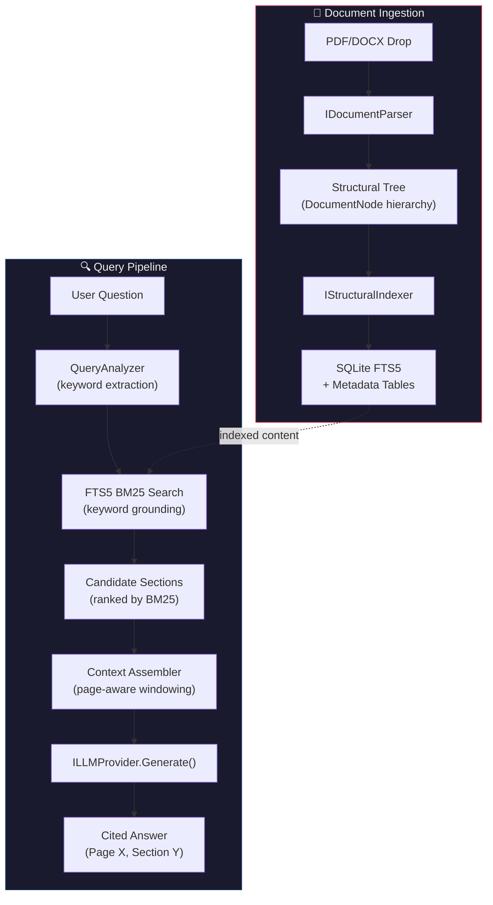
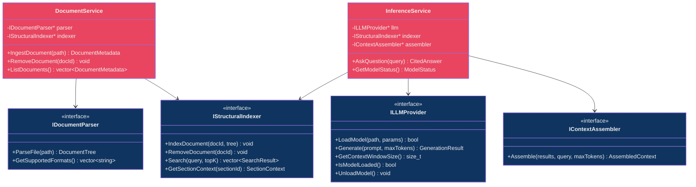

# LocalNotebookLLM — Architectural Blueprint & Implementation Plan

> *"Build it for speed. Design it for accuracy. Code it for eternity."*

---

## 1. Executive Summary: The Architect's Vision

**LocalNotebookLLM** is a fully offline, Windows-native Document Intelligence application. Users drop in PDFs (and later DOCX, EPUB), ask natural-language questions, and receive **page-cited, structurally-grounded answers** — all running on local hardware with zero cloud dependency.

### Why Vectorless?

Traditional RAG systems embed arbitrary 512-token chunks into a vector space and retrieve by cosine similarity. This causes three failure modes that are **unacceptable** for professional document work:

| Failure Mode | Root Cause | Our Mitigation |
|:---|:---|:---|
| **Context Fragmentation** | A 512-token window splits a paragraph from its heading | We index by **structural unit** (section, page, paragraph) — never arbitrarily |
| **Semantic Hallucination** | Cosine similarity ≠ factual relevance | We use **SQLite FTS5 BM25** keyword grounding — exact term matching first |
| **Citation Impossibility** | Chunk IDs are meaningless to users | Every indexed unit carries a **PageIndex + SectionPath** — citations are free |

### The Hybrid PageIndex Pipeline



### How It Works (Step by Step)

1. **Parse**: `IDocumentParser` (backed by MuPDF) extracts a `DocumentTree` — a hierarchy of `DocumentNode` objects where each node knows its type (Title, H1, H2, Paragraph, Table, ListItem), its page number, and its parent.
2. **Index**: `IStructuralIndexer` walks the tree and inserts each meaningful unit into SQLite FTS5 with metadata columns: `page_number`, `section_path` (e.g. "Chapter 3 > 3.2 Risk Factors"), `node_type`, `font_size_hint`.
3. **Query**: On user question, `QueryAnalyzer` extracts keywords and runs a BM25 `MATCH` query against FTS5. The top-K results are returned with their full section context.
4. **Assemble**: `ContextAssembler` rehydrates the surrounding structural context (parent heading, sibling paragraphs) up to the LLM's context window limit. It tags each block with `[Page X]`.
5. **Generate**: `ILLMProvider` (backed by llama.cpp) receives the assembled context + user question and produces a cited answer.

---

## 2. Interface Segregation: The Contract Layer

The system follows **Dependency Inversion** strictly. The `Core` layer defines interfaces; the `Infrastructure` layer provides concrete implementations. The `Application` layer orchestrates via these interfaces.

### Interface Hierarchy



### How `ILLMProvider` Interacts with `IDocumentParser`

**They don't interact directly.** This is a deliberate architectural decision:

```
IDocumentParser → produces → DocumentTree
                                  ↓
                          IStructuralIndexer → stores → SQLite
                                  ↓
                          (on query) IStructuralIndexer → retrieves → SearchResults
                                  ↓
                          IContextAssembler → formats → prompt context
                                  ↓
                          ILLMProvider → generates → answer
```

The `InferenceService` is the **mediator** that bridges the indexer and the LLM. The parser's output is consumed at ingestion time and never directly by the LLM. This ensures:
- Parser changes don't break inference
- LLM provider changes don't affect document processing
- Each component can be tested in complete isolation

---

## 3. Risk & Pitfall Registry

### Risk 1: PDF Encoding Edge Cases 🔴 CRITICAL

| Aspect | Detail |
|:---|:---|
| **Risk** | PDFs use wildly inconsistent internal encodings. Scanned PDFs have no text layer. Some PDFs use custom glyph mappings that produce garbage text. CJK fonts may not decode correctly. |
| **Impact** | Silent data corruption — the indexer stores garbage, and the LLM hallucinates based on it. User blames the app, not the PDF. |
| **Mitigation** | 1. Use **MuPDF** (battle-tested, handles most edge cases). 2. Implement a `TextQualityValidator` that checks extracted text for entropy/garbage ratio. 3. Flag low-quality extractions in the UI with a ⚠️ icon. 4. For scanned PDFs: detect empty text layers and suggest OCR (future: integrate Tesseract). |
| **Test** | Corpus of 50+ adversarial PDFs (scanned, CJK, forms, encrypted, corrupt). |

### Risk 2: RAM Bottleneck on Consumer Hardware 🔴 CRITICAL

| Aspect | Detail |
|:---|:---|
| **Risk** | LLM inference (even quantized 4-bit 7B models) requires 4-8 GB RAM. MuPDF parsing of large docs adds 200-500 MB. On a 16 GB machine, this leaves little room. |
| **Impact** | OOM crashes, system unresponsiveness, swap thrashing. |
| **Mitigation** | 1. **Memory budget system**: On startup, detect available RAM and select model tier (1.5B/3B/7B). 2. **Stream-parse documents** — never load entire PDF into memory; use MuPDF's page-by-page API. 3. **Unload model during ingestion**, reload on query (with fast-load caching via `mmap`). 4. SQLite is disk-backed — FTS5 index has minimal RAM footprint. |
| **Test** | Stress test with 500-page PDF + 7B model on 8 GB RAM machine. |

### Risk 3: Context Window Overflow 🟡 HIGH

| Aspect | Detail |
|:---|:---|
| **Risk** | User asks a question that matches 30 sections across 50 pages. The assembled context exceeds the LLM's context window (2K-8K tokens for small models). |
| **Impact** | Truncated context → incomplete answers → wrong citations. |
| **Mitigation** | 1. `ContextAssembler` enforces a **hard token budget** (80% of model's context window). 2. **Tiered inclusion**: First include exact BM25 matches, then parent headings, then siblings — stop when budget exhausted. 3. If too many results, include only top-3 by BM25 score with full context rather than top-10 with truncated context. 4. Display "X sections omitted due to model capacity" in UI. |
| **Test** | Query that matches entire document; verify no crash and coherent output. |

### Risk 4: Structural Heuristic Failures 🟡 HIGH

| Aspect | Detail |
|:---|:---|
| **Risk** | PDF is a *layout* format, not a *semantic* format. Headers are detected by font size/weight heuristics. A decorative large-font paragraph may be misclassified as a heading. |
| **Impact** | Incorrect section hierarchy → wrong citations → eroded trust. |
| **Mitigation** | 1. **Multi-signal heuristics**: font size + bold + position + whitespace gap + line count. 2. **Confidence scoring** on each node classification. Low-confidence nodes fall back to "Paragraph". 3. Allow user to **review and correct** the parsed structure in a tree view (Phase 2 feature). 4. Support PDF bookmarks/TOC as ground truth when available. |
| **Test** | Parse 20 diverse PDFs; manually verify structure tree accuracy rate > 85%. |

### Risk 5: LLM Citation Accuracy 🟡 HIGH

| Aspect | Detail |
|:---|:---|
| **Risk** | The LLM may fabricate page numbers or cite the wrong section, even when the correct context is provided. |
| **Impact** | User navigates to cited page and finds irrelevant content → trust destruction. |
| **Mitigation** | 1. **Prompt engineering**: Each context block is tagged `[SOURCE: Page X, Section "Y"]`. Prompt instructs: "You MUST only cite sources provided. Use the exact [SOURCE] tags." 2. **Post-generation validator**: Parse the LLM's output for `[Page X]` citations and verify they exist in the provided context. Flag unverifiable citations. 3. **Highlight the cited text** in the document viewer so users can visually confirm. |
| **Test** | Automated accuracy benchmark — 100 question/answer pairs with known correct pages. |

---

## 4. Detailed Solution Directory Map

```
LocalNotebookLLM/
├── 📁 CMakeLists.txt                          # Root CMake — orchestrates all targets
├── 📁 vcpkg.json                              # Dependency manifest (sqlite3, mupdf)
├── 📁 .gitmodules                             # llama.cpp as git submodule
│
├── 📁 external/                               # Third-party dependencies
│   ├── 📁 llama.cpp/                          # Git submodule
│   └── 📁 mupdf/                             # Git submodule or vcpkg
│
├── 📁 src/
│   ├── 📁 Core/                               # 🔵 Domain Layer (zero dependencies)
│   │   ├── CMakeLists.txt
│   │   ├── 📁 Interfaces/
│   │   │   ├── IDocumentParser.h              # Parse file → DocumentTree
│   │   │   ├── IStructuralIndexer.h           # Index/search structural units
│   │   │   ├── ILLMProvider.h                 # Model load/generate/unload
│   │   │   ├── IContextAssembler.h            # Assemble search results → prompt
│   │   │   └── IDocumentRepository.h          # CRUD for document metadata
│   │   ├── 📁 Models/
│   │   │   ├── DocumentTree.h                 # Tree of DocumentNode
│   │   │   ├── DocumentNode.h                 # Type, text, page, bbox, children
│   │   │   ├── SearchResult.h                 # BM25 result with section context
│   │   │   ├── CitedAnswer.h                  # Answer text + vector<Citation>
│   │   │   ├── DocumentMetadata.h             # ID, filename, page count, ingest time
│   │   │   └── ModelStatus.h                  # Loaded, RAM usage, context window
│   │   └── 📁 Enums/
│   │       ├── NodeType.h                     # Title, H1, H2, H3, Para, Table, List
│   │       └── DocumentFormat.h               # PDF, DOCX, EPUB, TXT
│   │
│   ├── 📁 Application/                        # 🟢 Use-Case / Service Layer
│   │   ├── CMakeLists.txt
│   │   ├── DocumentService.h / .cpp           # Ingest, remove, list documents
│   │   ├── InferenceService.h / .cpp          # Ask question → cited answer
│   │   ├── QueryAnalyzer.h / .cpp             # Extract keywords from query
│   │   └── ContextAssembler.h / .cpp          # Implements IContextAssembler
│   │
│   ├── 📁 Infrastructure/                     # 🔴 Concrete Implementations
│   │   ├── CMakeLists.txt
│   │   ├── 📁 Parsing/
│   │   │   ├── MuPdfParser.h / .cpp           # IDocumentParser → MuPDF backend
│   │   │   ├── StructureDetector.h / .cpp     # Font heuristics → NodeType
│   │   │   └── TextQualityValidator.h / .cpp  # Garbage detection
│   │   ├── 📁 Indexing/
│   │   │   ├── SqliteFts5Indexer.h / .cpp     # IStructuralIndexer → SQLite FTS5
│   │   │   ├── DatabaseManager.h / .cpp       # SQLite connection, migrations
│   │   │   └── Schema.sql                     # DDL for all tables
│   │   ├── 📁 LLM/
│   │   │   ├── LlamaCppProvider.h / .cpp      # ILLMProvider → llama.cpp backend
│   │   │   ├── PromptTemplates.h              # System/user prompt formatting
│   │   │   └── MemoryBudget.h / .cpp          # RAM detection & model tier selection
│   │   └── 📁 Storage/
│   │       └── SqliteDocumentRepository.h/.cpp # IDocumentRepository → SQLite
│   │
│   └── 📁 UI/                                 # 🟣 Presentation Layer
│       ├── CMakeLists.txt
│       ├── App.xaml / App.xaml.h / .cpp        # WinUI 3 Application entry
│       ├── MainWindow.xaml / .h / .cpp         # Shell: nav, title bar
│       ├── 📁 Pages/
│       │   ├── ChatPage.xaml / .h / .cpp       # Q&A interface
│       │   ├── LibraryPage.xaml / .h / .cpp    # Document management
│       │   └── SettingsPage.xaml / .h / .cpp   # Model selection, RAM budget
│       ├── 📁 Controls/
│       │   ├── DocumentCard.xaml / .h / .cpp   # Doc thumbnail + status
│       │   ├── CitationBadge.xaml / .h / .cpp  # [Page X] clickable badge
│       │   └── StructureTreeView.xaml/.h/.cpp  # Parsed doc structure viewer
│       ├── 📁 ViewModels/
│       │   ├── ChatViewModel.h / .cpp
│       │   ├── LibraryViewModel.h / .cpp
│       │   └── SettingsViewModel.h / .cpp
│       └── 📁 Styles/
│           ├── Colors.xaml                     # Design tokens
│           ├── Typography.xaml                 # SF Pro / Segoe UI Variable
│           └── Animations.xaml                 # Subtle transitions
│
├── 📁 tests/
│   ├── 📁 UnitTests/                          # 🧪 Fast, isolated, no I/O
│   │   ├── CMakeLists.txt
│   │   ├── StructureDetectorTests.cpp
│   │   ├── QueryAnalyzerTests.cpp
│   │   ├── ContextAssemblerTests.cpp
│   │   ├── TextQualityValidatorTests.cpp
│   │   └── 📁 TestData/
│   │       └── sample_nodes.json              # Synthetic DocumentNode data
│   │
│   └── 📁 FunctionalTests/                    # 🧪 End-to-end, real files
│       ├── CMakeLists.txt
│       ├── PdfIngestionTests.cpp
│       ├── Fts5SearchTests.cpp
│       ├── AccuracyBenchmarkTests.cpp
│       └── 📁 TestData/
│           ├── simple_report.pdf
│           ├── complex_financial.pdf
│           ├── scanned_document.pdf
│           └── 📁 golden/                     # Expected Q&A pairs
│               └── accuracy_benchmark.json
│
├── 📁 models/                                 # GGUF model files (git-ignored)
│   └── .gitkeep
│
├── 📁 docs/
│   ├── ARCHITECTURE.md
│   └── BUILDING.md
│
└── 📁 data/                                   # Runtime SQLite databases (git-ignored)
    └── .gitkeep
```

---

## 5. Core Implementation Logic

### 5.1 SQLite Schema (`Infrastructure/Indexing/Schema.sql`)

```sql
-- Document metadata
CREATE TABLE IF NOT EXISTS documents (
    id          INTEGER PRIMARY KEY AUTOINCREMENT,
    filename    TEXT NOT NULL,
    filepath    TEXT NOT NULL UNIQUE,
    page_count  INTEGER NOT NULL,
    ingested_at TEXT NOT NULL DEFAULT (datetime('now')),
    file_hash   TEXT NOT NULL  -- SHA-256 for dedup
);

-- Structural nodes (the parsed tree, flattened)
CREATE TABLE IF NOT EXISTS document_nodes (
    id            INTEGER PRIMARY KEY AUTOINCREMENT,
    document_id   INTEGER NOT NULL REFERENCES documents(id) ON DELETE CASCADE,
    parent_id     INTEGER REFERENCES document_nodes(id),
    node_type     TEXT NOT NULL,      -- 'title','h1','h2','h3','paragraph','table','list_item'
    page_number   INTEGER NOT NULL,
    section_path  TEXT NOT NULL,       -- "Chapter 3 > 3.2 Risk Factors"
    content       TEXT NOT NULL,
    font_size     REAL,
    is_bold       INTEGER DEFAULT 0,
    bbox_x        REAL, bbox_y REAL, bbox_w REAL, bbox_h REAL,
    sort_order    INTEGER NOT NULL     -- preserve document order
);

-- FTS5 index (external content — no data duplication)
CREATE VIRTUAL TABLE IF NOT EXISTS fts_index USING fts5(
    content,
    section_path,
    content='document_nodes',
    content_rowid='id',
    tokenize='unicode61 remove_diacritics 2',
    prefix='2 3'
);

-- Triggers to keep FTS5 in sync
CREATE TRIGGER IF NOT EXISTS fts_insert AFTER INSERT ON document_nodes BEGIN
    INSERT INTO fts_index(rowid, content, section_path)
    VALUES (new.id, new.content, new.section_path);
END;

CREATE TRIGGER IF NOT EXISTS fts_delete AFTER DELETE ON document_nodes BEGIN
    INSERT INTO fts_index(fts_index, rowid, content, section_path)
    VALUES ('delete', old.id, old.content, old.section_path);
END;

CREATE TRIGGER IF NOT EXISTS fts_update AFTER UPDATE ON document_nodes BEGIN
    INSERT INTO fts_index(fts_index, rowid, content, section_path)
    VALUES ('delete', old.id, old.content, old.section_path);
    INSERT INTO fts_index(rowid, content, section_path)
    VALUES (new.id, new.content, new.section_path);
END;

-- Indexes for fast lookups
CREATE INDEX IF NOT EXISTS idx_nodes_doc ON document_nodes(document_id);
CREATE INDEX IF NOT EXISTS idx_nodes_page ON document_nodes(document_id, page_number);
```

### 5.2 Core Interface Headers

#### `IDocumentParser.h`
```cpp
#pragma once
#include "Core/Models/DocumentTree.h"
#include "Core/Enums/DocumentFormat.h"
#include <filesystem>
#include <vector>
#include <expected>  // C++23

namespace LocalNotebookLLM::Core {

    struct ParseError {
        enum class Code { FileNotFound, UnsupportedFormat, CorruptFile, EncodingError, OutOfMemory };
        Code code;
        std::string message;
    };

    /// @brief Parses document files into structural trees.
    /// Implementations must be stateless and thread-safe.
    class IDocumentParser {
    public:
        virtual ~IDocumentParser() = default;

        /// Parse a file into a DocumentTree. Returns error on failure.
        [[nodiscard]]
        virtual std::expected<DocumentTree, ParseError>
        ParseFile(const std::filesystem::path& filePath) const = 0;

        /// Returns list of supported file extensions (e.g., {".pdf", ".docx"}).
        [[nodiscard]]
        virtual std::vector<std::string> GetSupportedFormats() const = 0;

        /// Check if a specific file can be parsed.
        [[nodiscard]]
        virtual bool CanParse(const std::filesystem::path& filePath) const = 0;
    };

} // namespace LocalNotebookLLM::Core
```

#### `IStructuralIndexer.h`
```cpp
#pragma once
#include "Core/Models/DocumentTree.h"
#include "Core/Models/SearchResult.h"
#include <cstdint>
#include <vector>
#include <string>
#include <expected>

namespace LocalNotebookLLM::Core {

    struct IndexError {
        enum class Code { DatabaseError, DocumentNotFound, DuplicateDocument };
        Code code;
        std::string message;
    };

    struct SearchOptions {
        int topK = 10;
        int documentIdFilter = -1;  // -1 = search all documents
        double minScore = 0.0;
    };

    /// @brief Indexes and searches structural document content.
    /// Backed by SQLite FTS5 for keyword-grounded retrieval.
    class IStructuralIndexer {
    public:
        virtual ~IStructuralIndexer() = default;

        /// Index an entire document tree. Replaces existing index for this docId.
        [[nodiscard]]
        virtual std::expected<void, IndexError>
        IndexDocument(int64_t documentId, const DocumentTree& tree) = 0;

        /// Remove all indexed content for a document.
        virtual void RemoveDocument(int64_t documentId) = 0;

        /// Search indexed content using BM25 ranking.
        [[nodiscard]]
        virtual std::vector<SearchResult>
        Search(const std::string& query, const SearchOptions& options = {}) const = 0;

        /// Retrieve full section context for a search result (parent heading + siblings).
        [[nodiscard]]
        virtual SectionContext
        GetSectionContext(int64_t nodeId) const = 0;

        /// Get total indexed node count (for diagnostics).
        [[nodiscard]]
        virtual size_t GetIndexedNodeCount() const = 0;
    };

} // namespace LocalNotebookLLM::Core
```

#### `ILLMProvider.h`
```cpp
#pragma once
#include <string>
#include <filesystem>
#include <functional>
#include <expected>
#include <cstddef>

namespace LocalNotebookLLM::Core {

    struct ModelParams {
        int contextWindowSize = 4096;
        int gpuLayers = 0;          // 0 = CPU only, -1 = auto
        int threadCount = 0;        // 0 = auto-detect
        float temperature = 0.3f;   // Low temp for factual accuracy
        float topP = 0.9f;
        int topK = 40;
    };

    struct GenerationResult {
        std::string text;
        int tokensGenerated = 0;
        int tokensPrompt = 0;
        double generationTimeMs = 0.0;
        bool wasTruncated = false;
    };

    struct LLMError {
        enum class Code { ModelNotFound, LoadFailed, OutOfMemory, GenerationFailed, ContextOverflow };
        Code code;
        std::string message;
    };

    using StreamCallback = std::function<void(const std::string& token)>;

    /// @brief Provides LLM inference capabilities.
    /// Implementations wrap specific inference engines (llama.cpp, etc.).
    class ILLMProvider {
    public:
        virtual ~ILLMProvider() = default;

        /// Load a GGUF model from disk. Unloads any previously loaded model.
        [[nodiscard]]
        virtual std::expected<void, LLMError>
        LoadModel(const std::filesystem::path& modelPath, const ModelParams& params = {}) = 0;

        /// Generate a completion for the given prompt.
        [[nodiscard]]
        virtual std::expected<GenerationResult, LLMError>
        Generate(const std::string& prompt, int maxTokens = 1024) = 0;

        /// Generate with streaming callback (token-by-token).
        [[nodiscard]]
        virtual std::expected<GenerationResult, LLMError>
        GenerateStreaming(const std::string& prompt, int maxTokens, StreamCallback callback) = 0;

        /// Returns the context window size of the loaded model (in tokens).
        [[nodiscard]]
        virtual size_t GetContextWindowSize() const = 0;

        /// Returns approximate token count for a string (fast estimate).
        [[nodiscard]]
        virtual size_t EstimateTokenCount(const std::string& text) const = 0;

        [[nodiscard]] virtual bool IsModelLoaded() const = 0;
        virtual void UnloadModel() = 0;
    };

} // namespace LocalNotebookLLM::Core
```

### 5.3 Application Services (Dependency Inversion in Action)

#### `DocumentService.h`
```cpp
#pragma once
#include "Core/Interfaces/IDocumentParser.h"
#include "Core/Interfaces/IStructuralIndexer.h"
#include "Core/Interfaces/IDocumentRepository.h"
#include "Core/Models/DocumentMetadata.h"
#include <memory>
#include <filesystem>
#include <vector>
#include <expected>
#include <functional>

namespace LocalNotebookLLM::Application {

    struct IngestionProgress {
        enum class Stage { Parsing, Validating, Indexing, Complete, Failed };
        Stage stage;
        double progressPct = 0.0;  // 0.0 - 1.0
        std::string message;
    };

    using ProgressCallback = std::function<void(const IngestionProgress&)>;

    /// @brief Orchestrates document lifecycle: ingest, remove, query metadata.
    /// Depends ONLY on interfaces — never on concrete implementations.
    class DocumentService {
    public:
        // Constructor injection — the DI entry point
        DocumentService(
            std::unique_ptr<Core::IDocumentParser> parser,
            std::shared_ptr<Core::IStructuralIndexer> indexer,
            std::shared_ptr<Core::IDocumentRepository> repository
        );

        ~DocumentService();

        // Non-copyable, movable
        DocumentService(const DocumentService&) = delete;
        DocumentService& operator=(const DocumentService&) = delete;
        DocumentService(DocumentService&&) noexcept;
        DocumentService& operator=(DocumentService&&) noexcept;

        /// Ingest a document: parse → validate → index → store metadata.
        /// Reports progress via callback for UI updates.
        [[nodiscard]]
        std::expected<Core::DocumentMetadata, std::string>
        IngestDocument(const std::filesystem::path& filePath, ProgressCallback progress = nullptr);

        /// Remove a document and its index.
        void RemoveDocument(int64_t documentId);

        /// List all ingested documents.
        [[nodiscard]]
        std::vector<Core::DocumentMetadata> ListDocuments() const;

        /// Check if a file has already been ingested (by SHA-256 hash).
        [[nodiscard]]
        bool IsAlreadyIngested(const std::filesystem::path& filePath) const;

    private:
        struct Impl;
        std::unique_ptr<Impl> m_impl;  // Pimpl for ABI stability
    };

} // namespace LocalNotebookLLM::Application
```

#### `InferenceService.h`
```cpp
#pragma once
#include "Core/Interfaces/ILLMProvider.h"
#include "Core/Interfaces/IStructuralIndexer.h"
#include "Core/Interfaces/IContextAssembler.h"
#include "Core/Models/CitedAnswer.h"
#include <memory>
#include <string>
#include <expected>
#include <functional>

namespace LocalNotebookLLM::Application {

    struct AnswerProgress {
        enum class Stage { Searching, Assembling, Generating, Validating, Complete };
        Stage stage;
        std::string partialAnswer;  // For streaming display
    };

    using AnswerProgressCallback = std::function<void(const AnswerProgress&)>;

    /// @brief Orchestrates the query → search → assemble → generate pipeline.
    class InferenceService {
    public:
        InferenceService(
            std::shared_ptr<Core::ILLMProvider> llmProvider,
            std::shared_ptr<Core::IStructuralIndexer> indexer,
            std::unique_ptr<Core::IContextAssembler> assembler
        );

        ~InferenceService();

        InferenceService(const InferenceService&) = delete;
        InferenceService& operator=(const InferenceService&) = delete;
        InferenceService(InferenceService&&) noexcept;
        InferenceService& operator=(InferenceService&&) noexcept;

        /// Ask a question against the indexed corpus. Returns a cited answer.
        [[nodiscard]]
        std::expected<Core::CitedAnswer, std::string>
        AskQuestion(const std::string& query, AnswerProgressCallback progress = nullptr);

        /// Ask with streaming (token-by-token callback).
        [[nodiscard]]
        std::expected<Core::CitedAnswer, std::string>
        AskQuestionStreaming(const std::string& query,
                            Core::StreamCallback tokenCallback,
                            AnswerProgressCallback progress = nullptr);

        /// Load an LLM model.
        [[nodiscard]]
        std::expected<void, std::string>
        LoadModel(const std::filesystem::path& modelPath, const Core::ModelParams& params = {});

        /// Get current model status.
        [[nodiscard]]
        Core::ModelStatus GetModelStatus() const;

    private:
        struct Impl;
        std::unique_ptr<Impl> m_impl;

        /// Validate that all citations in the answer reference provided context.
        void ValidateCitations(Core::CitedAnswer& answer) const;
    };

} // namespace LocalNotebookLLM::Application
```

### 5.4 Structural Indexer Core Logic (The Heart of the System)

```cpp
// Infrastructure/Indexing/SqliteFts5Indexer.cpp — Core indexing logic

void SqliteFts5Indexer::IndexDocument(int64_t docId, const DocumentTree& tree) {
    auto& db = m_dbManager->GetConnection();

    // Transaction for atomicity and performance
    SqliteTransaction txn(db);

    // Remove previous index for this document (re-index support)
    RemoveDocument(docId);

    // Walk the tree depth-first, maintaining section path
    std::string sectionPath;
    int sortOrder = 0;

    std::function<void(const DocumentNode&, int64_t parentDbId)> walkTree;
    walkTree = [&](const DocumentNode& node, int64_t parentDbId) {

        // Build section path: "Chapter 1 > 1.2 Methods > Paragraph"
        std::string currentPath = sectionPath;
        if (node.IsHeading()) {
            if (!currentPath.empty()) currentPath += " > ";
            currentPath += node.GetText().substr(0, 80);  // Truncate long headings
            sectionPath = currentPath;
        }

        // Insert node into document_nodes table
        // (FTS5 trigger auto-inserts into fts_index)
        auto stmt = db.Prepare(R"(
            INSERT INTO document_nodes
                (document_id, parent_id, node_type, page_number, section_path,
                 content, font_size, is_bold, bbox_x, bbox_y, bbox_w, bbox_h, sort_order)
            VALUES (?, ?, ?, ?, ?, ?, ?, ?, ?, ?, ?, ?, ?)
        )");

        stmt.Bind(1, docId);
        stmt.Bind(2, parentDbId > 0 ? parentDbId : std::optional<int64_t>{});
        stmt.Bind(3, NodeTypeToString(node.GetType()));
        stmt.Bind(4, node.GetPageNumber());
        stmt.Bind(5, currentPath.empty() ? "Document Root" : currentPath);
        stmt.Bind(6, node.GetText());
        stmt.Bind(7, node.GetFontSize());
        stmt.Bind(8, node.IsBold() ? 1 : 0);

        auto bbox = node.GetBoundingBox();
        stmt.Bind(9, bbox.x);
        stmt.Bind(10, bbox.y);
        stmt.Bind(11, bbox.w);
        stmt.Bind(12, bbox.h);
        stmt.Bind(13, sortOrder++);

        stmt.Execute();
        int64_t nodeDbId = db.LastInsertRowId();

        // Recurse into children
        for (const auto& child : node.GetChildren()) {
            walkTree(child, nodeDbId);
        }

        // Restore section path when leaving a heading scope
        if (node.IsHeading()) {
            auto lastSep = currentPath.rfind(" > ");
            sectionPath = (lastSep != std::string::npos) ? currentPath.substr(0, lastSep) : "";
        }
    };

    // Walk from root
    walkTree(tree.GetRoot(), -1);

    txn.Commit();
}

std::vector<SearchResult> SqliteFts5Indexer::Search(
    const std::string& query, const SearchOptions& options) const
{
    auto& db = m_dbManager->GetConnection();

    // BM25 search with FTS5
    std::string sql = R"(
        SELECT
            dn.id,
            dn.document_id,
            dn.node_type,
            dn.page_number,
            dn.section_path,
            dn.content,
            rank  -- BM25 score (negative; closer to 0 = better match)
        FROM fts_index
        JOIN document_nodes dn ON dn.id = fts_index.rowid
        WHERE fts_index MATCH ?
    )";

    if (options.documentIdFilter >= 0) {
        sql += " AND dn.document_id = " + std::to_string(options.documentIdFilter);
    }

    sql += " ORDER BY rank LIMIT ?";

    auto stmt = db.Prepare(sql);
    stmt.Bind(1, EscapeFts5Query(query));
    stmt.Bind(2, options.topK);

    std::vector<SearchResult> results;
    while (stmt.Step()) {
        SearchResult r;
        r.nodeId       = stmt.GetInt64(0);
        r.documentId   = stmt.GetInt64(1);
        r.nodeType     = StringToNodeType(stmt.GetString(2));
        r.pageNumber   = stmt.GetInt(3);
        r.sectionPath  = stmt.GetString(4);
        r.content      = stmt.GetString(5);
        r.bm25Score    = -stmt.GetDouble(6);  // Negate for intuitive scoring
        results.push_back(std::move(r));
    }

    return results;
}
```

---

## 6. Testing Strategy

### 6.1 Accuracy Engine Test Cases

The "Accuracy Engine" is a benchmark suite that programmatically verifies the LLM's citation accuracy against a known-good dataset.

#### Golden Dataset Format (`tests/FunctionalTests/TestData/golden/accuracy_benchmark.json`)
```json
{
  "document": "simple_report.pdf",
  "qa_pairs": [
    {
      "id": "Q001",
      "question": "What was the total revenue in Q3?",
      "expected_pages": [12, 13],
      "expected_section": "Financial Results > Q3 Summary",
      "expected_keywords": ["revenue", "$4.2M"],
      "difficulty": "easy"
    },
    {
      "id": "Q002",
      "question": "What risk factors were identified for the Asia-Pacific region?",
      "expected_pages": [28, 29, 30],
      "expected_section": "Risk Factors > Regional Analysis",
      "expected_keywords": ["Asia-Pacific", "currency", "regulatory"],
      "difficulty": "medium"
    },
    {
      "id": "Q003",
      "question": "Compare the margin improvements between Q2 and Q4.",
      "expected_pages": [11, 15],
      "expected_section": "Financial Results",
      "expected_keywords": ["margin", "improvement", "Q2", "Q4"],
      "difficulty": "hard"
    }
  ]
}
```

#### Accuracy Metrics

| Metric | Formula | Pass Threshold |
|:---|:---|:---|
| **Page Recall** | (correct pages cited) / (expected pages) | ≥ 80% |
| **Page Precision** | (correct pages cited) / (all pages cited) | ≥ 70% |
| **Section Match** | fuzzy match of cited section vs expected section | ≥ 75% similarity |
| **Keyword Coverage** | (expected keywords in answer) / (total expected keywords) | ≥ 60% |
| **Hallucination Rate** | (citations not in provided context) / (total citations) | ≤ 10% |

#### Sample Accuracy Benchmark Test

```cpp
// tests/FunctionalTests/AccuracyBenchmarkTests.cpp

#include <gtest/gtest.h>
#include "Application/InferenceService.h"
#include "Application/DocumentService.h"
#include "Infrastructure/LLM/LlamaCppProvider.h"
#include "Infrastructure/Indexing/SqliteFts5Indexer.h"
#include "Infrastructure/Parsing/MuPdfParser.h"
#include <nlohmann/json.hpp>
#include <fstream>

using namespace LocalNotebookLLM;
using json = nlohmann::json;

class AccuracyBenchmarkTest : public ::testing::Test {
protected:
    void SetUp() override {
        // Wire up real implementations (functional test)
        auto parser  = std::make_unique<Infrastructure::MuPdfParser>();
        auto indexer = std::make_shared<Infrastructure::SqliteFts5Indexer>(":memory:");
        auto repo    = std::make_shared<Infrastructure::SqliteDocumentRepository>(":memory:");

        m_docService = std::make_unique<Application::DocumentService>(
            std::move(parser), indexer, repo);

        auto llm = std::make_shared<Infrastructure::LlamaCppProvider>();
        auto assembler = std::make_unique<Application::ContextAssembler>();

        m_inferService = std::make_unique<Application::InferenceService>(
            llm, indexer, std::move(assembler));

        // Load model
        auto result = m_inferService->LoadModel("models/gemma-3-4b-it-Q4_K_M.gguf");
        ASSERT_TRUE(result.has_value()) << "Failed to load model: " << result.error();

        // Ingest test document
        auto ingestResult = m_docService->IngestDocument("tests/FunctionalTests/TestData/simple_report.pdf");
        ASSERT_TRUE(ingestResult.has_value()) << "Failed to ingest: " << ingestResult.error();
    }

    std::unique_ptr<Application::DocumentService> m_docService;
    std::unique_ptr<Application::InferenceService> m_inferService;
};

TEST_F(AccuracyBenchmarkTest, PageCitationAccuracy) {
    // Load golden dataset
    std::ifstream f("tests/FunctionalTests/TestData/golden/accuracy_benchmark.json");
    json benchmark = json::parse(f);

    int totalPairs = 0;
    int passedPageRecall = 0;
    int passedPagePrecision = 0;
    double totalHallucinationRate = 0.0;

    for (const auto& qa : benchmark["qa_pairs"]) {
        totalPairs++;
        std::string question = qa["question"];
        std::set<int> expectedPages(qa["expected_pages"].begin(), qa["expected_pages"].end());

        // Ask the question
        auto answer = m_inferService->AskQuestion(question);
        ASSERT_TRUE(answer.has_value()) << "Query failed: " << answer.error();

        // Extract cited pages from the answer
        std::set<int> citedPages;
        for (const auto& citation : answer->citations) {
            citedPages.insert(citation.pageNumber);
        }

        // Page Recall: How many expected pages were cited?
        int correctCitations = 0;
        for (int page : expectedPages) {
            if (citedPages.count(page)) correctCitations++;
        }
        double recall = static_cast<double>(correctCitations) / expectedPages.size();
        if (recall >= 0.80) passedPageRecall++;

        // Page Precision: How many cited pages were expected?
        int preciseCitations = 0;
        for (int page : citedPages) {
            if (expectedPages.count(page)) preciseCitations++;
        }
        double precision = citedPages.empty() ? 0.0
                         : static_cast<double>(preciseCitations) / citedPages.size();
        if (precision >= 0.70) passedPagePrecision++;

        // Hallucination check: cited pages not in provided context
        int hallucinated = 0;
        for (const auto& citation : answer->citations) {
            if (!citation.isVerified) hallucinated++;
        }
        double hallucinationRate = answer->citations.empty() ? 0.0
                                 : static_cast<double>(hallucinated) / answer->citations.size();
        totalHallucinationRate += hallucinationRate;

        // Log for human review
        std::cout << "[" << qa["id"].get<std::string>() << "] "
                  << "Recall=" << recall << " Precision=" << precision
                  << " Hallucination=" << hallucinationRate << "\n";
    }

    // Aggregate assertions
    double recallPassRate = static_cast<double>(passedPageRecall) / totalPairs;
    double precisionPassRate = static_cast<double>(passedPagePrecision) / totalPairs;
    double avgHallucination = totalHallucinationRate / totalPairs;

    EXPECT_GE(recallPassRate, 0.70) << "Page recall pass rate too low";
    EXPECT_GE(precisionPassRate, 0.70) << "Page precision pass rate too low";
    EXPECT_LE(avgHallucination, 0.15) << "Hallucination rate too high";
}
```

### 6.2 Unit Test: PDF-to-Text-Tree Conversion

```cpp
// tests/UnitTests/StructureDetectorTests.cpp

#include <gtest/gtest.h>
#include "Infrastructure/Parsing/StructureDetector.h"
#include "Core/Models/DocumentNode.h"
#include "Core/Enums/NodeType.h"

using namespace LocalNotebookLLM;
using namespace LocalNotebookLLM::Infrastructure;
using namespace LocalNotebookLLM::Core;

class StructureDetectorTest : public ::testing::Test {
protected:
    StructureDetector detector;

    /// Helper: create a raw text block as MuPDF would extract it
    static RawTextBlock MakeBlock(const std::string& text, float fontSize,
                                  bool bold, float x, float y) {
        return RawTextBlock{
            .text = text,
            .fontSize = fontSize,
            .isBold = bold,
            .bbox = {x, y, 500.0f, fontSize + 4.0f},
            .pageNumber = 1
        };
    }
};

// --- NodeType Classification Tests ---

TEST_F(StructureDetectorTest, LargeBoldTextClassifiedAsTitle) {
    auto block = MakeBlock("Annual Financial Report 2025", 24.0f, true, 72.0f, 72.0f);
    auto node = detector.Classify(block);

    EXPECT_EQ(node.GetType(), NodeType::Title);
    EXPECT_EQ(node.GetText(), "Annual Financial Report 2025");
    EXPECT_EQ(node.GetPageNumber(), 1);
}

TEST_F(StructureDetectorTest, MediumBoldTextClassifiedAsH1) {
    auto block = MakeBlock("1. Introduction", 18.0f, true, 72.0f, 150.0f);
    auto node = detector.Classify(block);

    EXPECT_EQ(node.GetType(), NodeType::H1);
}

TEST_F(StructureDetectorTest, SmallBoldTextClassifiedAsH2) {
    auto block = MakeBlock("1.1 Background", 14.0f, true, 72.0f, 200.0f);
    auto node = detector.Classify(block);

    EXPECT_EQ(node.GetType(), NodeType::H2);
}

TEST_F(StructureDetectorTest, NormalTextClassifiedAsParagraph) {
    auto block = MakeBlock(
        "Lorem ipsum dolor sit amet, consectetur adipiscing elit. "
        "Sed do eiusmod tempor incididunt ut labore et dolore magna aliqua.",
        11.0f, false, 72.0f, 250.0f);
    auto node = detector.Classify(block);

    EXPECT_EQ(node.GetType(), NodeType::Paragraph);
}

TEST_F(StructureDetectorTest, BulletPrefixClassifiedAsListItem) {
    auto block = MakeBlock("• Revenue increased by 15%", 11.0f, false, 90.0f, 300.0f);
    auto node = detector.Classify(block);

    EXPECT_EQ(node.GetType(), NodeType::ListItem);
}

TEST_F(StructureDetectorTest, NumberedPrefixClassifiedAsListItem) {
    auto block = MakeBlock("3. Update the configuration file", 11.0f, false, 90.0f, 300.0f);
    auto node = detector.Classify(block);

    EXPECT_EQ(node.GetType(), NodeType::ListItem);
}

// --- Tree Construction Tests ---

TEST_F(StructureDetectorTest, BuildTreeMaintainsHierarchy) {
    std::vector<RawTextBlock> blocks = {
        MakeBlock("Report Title", 24.0f, true, 72.0f, 72.0f),
        MakeBlock("Chapter 1", 18.0f, true, 72.0f, 150.0f),
        MakeBlock("Some paragraph text under chapter 1.", 11.0f, false, 72.0f, 200.0f),
        MakeBlock("1.1 Subsection", 14.0f, true, 72.0f, 260.0f),
        MakeBlock("Content under subsection 1.1.", 11.0f, false, 72.0f, 310.0f),
        MakeBlock("Chapter 2", 18.0f, true, 72.0f, 400.0f),
        MakeBlock("Content under chapter 2.", 11.0f, false, 72.0f, 450.0f),
    };

    auto tree = detector.BuildTree(blocks);
    auto& root = tree.GetRoot();

    // Root should be the Title
    EXPECT_EQ(root.GetType(), NodeType::Title);
    EXPECT_EQ(root.GetText(), "Report Title");

    // Title has 2 children: Chapter 1 and Chapter 2
    ASSERT_EQ(root.GetChildren().size(), 2);

    auto& ch1 = root.GetChildren()[0];
    EXPECT_EQ(ch1.GetType(), NodeType::H1);
    EXPECT_EQ(ch1.GetText(), "Chapter 1");

    // Chapter 1 has 2 children: a paragraph and subsection 1.1
    ASSERT_EQ(ch1.GetChildren().size(), 2);
    EXPECT_EQ(ch1.GetChildren()[0].GetType(), NodeType::Paragraph);

    auto& sub11 = ch1.GetChildren()[1];
    EXPECT_EQ(sub11.GetType(), NodeType::H2);
    EXPECT_EQ(sub11.GetText(), "1.1 Subsection");

    // Subsection has 1 child paragraph
    ASSERT_EQ(sub11.GetChildren().size(), 1);
    EXPECT_EQ(sub11.GetChildren()[0].GetType(), NodeType::Paragraph);

    // Chapter 2
    auto& ch2 = root.GetChildren()[1];
    EXPECT_EQ(ch2.GetType(), NodeType::H1);
    ASSERT_EQ(ch2.GetChildren().size(), 1);
}

// --- Edge Cases ---

TEST_F(StructureDetectorTest, EmptyBlockListProducesEmptyTree) {
    auto tree = detector.BuildTree({});
    EXPECT_TRUE(tree.IsEmpty());
}

TEST_F(StructureDetectorTest, SingleParagraphNoHeadingCreatesFlat) {
    std::vector<RawTextBlock> blocks = {
        MakeBlock("Just a paragraph with no heading.", 11.0f, false, 72.0f, 72.0f),
    };

    auto tree = detector.BuildTree(blocks);
    auto& root = tree.GetRoot();

    // With no title/heading, root is a synthetic "Document" node
    EXPECT_EQ(root.GetType(), NodeType::Document);
    ASSERT_EQ(root.GetChildren().size(), 1);
    EXPECT_EQ(root.GetChildren()[0].GetType(), NodeType::Paragraph);
}

TEST_F(StructureDetectorTest, GarbageTextDetectedLowConfidence) {
    // Simulate garbled PDF extraction
    auto block = MakeBlock("Ø£¤§½¾¿ÀÁÂÃÄÅÆÇ", 11.0f, false, 72.0f, 72.0f);
    auto node = detector.Classify(block);

    EXPECT_LT(node.GetConfidence(), 0.5);  // Low confidence flag
}

TEST_F(StructureDetectorTest, PageBoundaryPreserved) {
    std::vector<RawTextBlock> blocks = {
        MakeBlock("Page 1 Content", 11.0f, false, 72.0f, 72.0f),
        // pageNumber is set inside MakeBlock — override for page 2
    };
    blocks[0].pageNumber = 1;

    RawTextBlock page2Block = MakeBlock("Page 2 Content", 11.0f, false, 72.0f, 72.0f);
    page2Block.pageNumber = 2;
    blocks.push_back(page2Block);

    auto tree = detector.BuildTree(blocks);

    // Verify page numbers propagated
    auto allNodes = tree.Flatten();
    bool hasPage1 = false, hasPage2 = false;
    for (const auto& n : allNodes) {
        if (n.GetPageNumber() == 1) hasPage1 = true;
        if (n.GetPageNumber() == 2) hasPage2 = true;
    }
    EXPECT_TRUE(hasPage1);
    EXPECT_TRUE(hasPage2);
}
```

---

## 7. The "Apple-Inspired" UI Component Roadmap

### Design Language: "Quiet Intelligence"

Inspired by Apple's design philosophy — the interface should feel like it **disappears**, leaving only the content and the conversation.

### Technology Choice

> [!IMPORTANT]
> **WinUI 3 with C++/WinRT** is the recommended framework. It provides:
> - Native Windows 11 Mica/Acrylic materials
> - Fluent Design system (closest to Apple's aesthetic on Windows)
> - C++ performance without managed runtime overhead
> - XAML for declarative, maintainable UI
>
> **Alternative**: If WinUI 3's C++ story proves too cumbersome, fall back to **Qt 6 QML** which offers superior C++ integration and cross-platform potential.

### Color System

| Token | Light Mode | Dark Mode | Usage |
|:---|:---|:---|:---|
| `Surface` | `#FAFAFA` | `#1C1C1E` | Main background |
| `SurfaceElevated` | `#FFFFFF` | `#2C2C2E` | Cards, panels |
| `SurfaceOverlay` | `#F2F2F7` | `#3A3A3C` | Hover states |
| `TextPrimary` | `#1D1D1F` | `#F5F5F7` | Headings, body |
| `TextSecondary` | `#86868B` | `#98989D` | Captions, meta |
| `AccentBlue` | `#0071E3` | `#2997FF` | Primary actions |
| `AccentGreen` | `#34C759` | `#30D158` | Success, indexed |
| `AccentOrange` | `#FF9500` | `#FF9F0A` | Warnings |
| `AccentRed` | `#FF3B30` | `#FF453A` | Errors, delete |

### Typography

| Role | Font | Weight | Size |
|:---|:---|:---|:---|
| Display | Segoe UI Variable Display | SemiBold | 34px |
| Title | Segoe UI Variable Text | SemiBold | 22px |
| Headline | Segoe UI Variable Text | SemiBold | 17px |
| Body | Segoe UI Variable Text | Regular | 15px |
| Caption | Segoe UI Variable Text | Regular | 13px |
| Mono (code/citations) | Cascadia Code | Regular | 13px |

### Component Roadmap

#### Phase 1: Core Shell (MVP)

| Component | Description | Priority |
|:---|:---|:---|
| **MainWindow** | Mica backdrop, custom title bar, 3-column nav (sidebar + content + detail) | P0 |
| **ChatPage** | Message bubbles, streaming text, citation badges inline | P0 |
| **LibraryPage** | Grid/list of document cards with ingest status | P0 |
| **DocumentCard** | Thumbnail, filename, page count, status badge (Indexed ✓ / Processing ⏳ / Error ⚠️) | P0 |
| **CitationBadge** | `[Page 12]` pill — clickable, opens doc at that page | P0 |

#### Phase 2: Intelligence Features

| Component | Description | Priority |
|:---|:---|:---|
| **StructureTreeView** | Expandable tree showing parsed document hierarchy | P1 |
| **DocumentViewer** | Embedded PDF viewer with highlight-on-cite | P1 |
| **SettingsPage** | Model picker, RAM budget slider, thread count | P1 |
| **SearchOverlay** | `Ctrl+K` quick search across all documents | P1 |

#### Phase 3: Polish

| Component | Description | Priority |
|:---|:---|:---|
| **OnboardingFlow** | First-run wizard: select model, drop first PDF | P2 |
| **ProgressRing** | Custom animated ring for ingestion/generation | P2 |
| **ToastNotifications** | Non-intrusive status updates | P2 |
| **KeyboardShortcuts** | Full keyboard navigation (accessibility) | P2 |

### Animation Guidelines

| Interaction | Animation | Duration | Easing |
|:---|:---|:---|:---|
| Page transition | Slide + fade | 300ms | `cubic-bezier(0.25, 0.1, 0.25, 1.0)` |
| Card hover | Scale 1.0 → 1.02 + shadow elevation | 200ms | ease-out |
| Message appear | Fade up from y+8px | 250ms | ease-out |
| Citation badge | Pulse once on new citation | 400ms | ease-in-out |
| Progress ring | Continuous rotation + gradient sweep | ∞ | linear |

---

## 8. Verification Plan

### Automated Tests

```bash
# Build everything (from VS Developer Command Prompt)
cmake -B build -DCMAKE_BUILD_TYPE=Release
cmake --build build --config Release

# Run unit tests (fast, no GPU/model required)
cd build && ctest --test-dir tests/UnitTests -C Release --output-on-failure

# Run functional tests (requires model + test PDFs)
cd build && ctest --test-dir tests/FunctionalTests -C Release --output-on-failure -R "Fts5|Ingestion"

# Run accuracy benchmark (slow, requires model)
cd build && ctest --test-dir tests/FunctionalTests -C Release --output-on-failure -R "AccuracyBenchmark"
```

### Manual Verification
1. **Build on clean Windows 11 machine** with VS 2022
2. **Drop 3 test PDFs** (simple, complex, scanned) — verify ingest progress and status
3. **Ask 5 test questions** — visually verify citations match expected pages
4. **Monitor RAM** via Task Manager during ingestion + inference — should stay under 8 GB with 7B model
5. **UI review**: Dark/light mode toggle, animations, keyboard navigation

---

## Open Questions

> [!IMPORTANT]
> **Q1: UI Framework Decision** — WinUI 3 (C++/WinRT) vs Qt 6 (QML)?
> - WinUI 3 = most native Windows 11 feel, but C++ support is secondary to C#
> - Qt 6 QML = superior C++ integration, cross-platform, but non-native look requires more styling work
> - **Recommendation**: Start with WinUI 3. If C++ friction is too high within the first sprint, pivot to Qt 6.

> [!IMPORTANT]
> **Q2: Target LLM Models** — Which GGUF models should we support out of the box?
> - Gemma 3 4B IT (proven in your AIHollowShell project)
> - Phi-3.5 Mini 3.8B
> - Llama 3.2 3B
> - Should we also target 7B+ models for users with >16 GB RAM?

> [!WARNING]
> **Q3: OCR for Scanned PDFs** — Should we integrate Tesseract OCR in Phase 1, or defer to Phase 2?
> - Phase 1 integration adds ~2 weeks of complexity
> - Without it, scanned PDFs will show a "No text detected" warning
> - **Recommendation**: Defer to Phase 2. Detect and warn in Phase 1.

> [!IMPORTANT]
> **Q4: Build System** — CMake (as laid out) or MSBuild/vcxproj?
> - CMake provides cross-platform potential and better llama.cpp integration
> - MSBuild is more natural for WinUI 3 projects
> - **Recommendation**: CMake with subdirectory inclusion for llama.cpp + MuPDF, but WinUI 3 project may require a hybrid approach (CMake for Core/Application/Infrastructure, MSBuild for UI).
